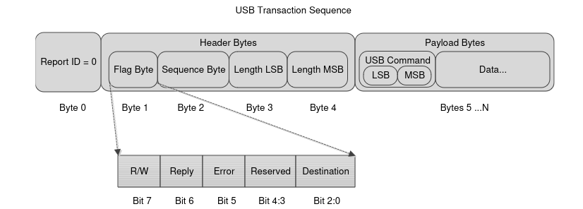
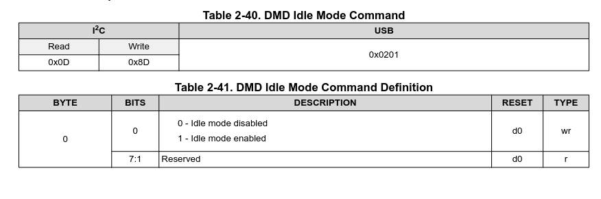
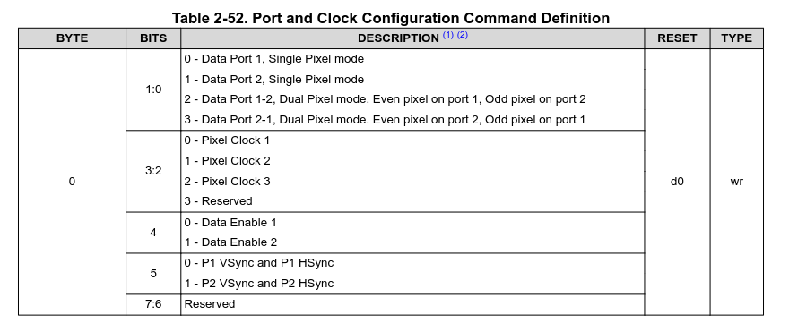

# How does communication work?

How things work in detail is explained in the [DLPC900 user guide](https://www.ti.com/lit/ug/dlpu018j/dlpu018j.pdf?ts=1720683938480). This is more a quick, practical reminder.

In general, all commands and replies have the same structure, see also the image below:

- **byte 0**: report ID, set to 0
- **byte 1**: flag byte
  - bit 7: read/write
  - bit 6: reply
  - bit 5: error
  - bit 4:3: reserved
  - bit 2:1: destination
- **byte 2**: sequence byte - If you get an answer back, the answer will have the same sequence byte.
- **byte 3**: Length LSB - number of bytes in payload
- **byte 4**: Length MSB - number of bytes in payload
- **byte 5** and onward: At least the USB command, followed by any data.

Weirdly, byte 0 is not actually given in the replies from the device as far as I can tell, so remember that when parsing.



## Constructing a new command

### The simplest case

To construct a new command, use the manual to find the USB command. Lets take turning 'Idle mode' on and off as an example.



The USB-command is `0x0201`, and the payload required is 1 byte, with only 1 parameter. If only one input parameter is required in one byte, life is simple, and you can simply use

``` python
self.send_command('w', <random number>, 0x1A0A, [1])
```

to enable idle mode.

### A more complex example

If there are multiple input arguments, you need to make it a bit more complicated. As an example, the port and clock configuration (section 2.3.3.1) has command `0x1A03` and looks like this:



You now need to craft your byte a bit more carefully, for instance:

``` python
payload = 0
payload |= 2 & 0x03            # mask input so only the correct bits are used
payload |= (0 & 0x03) << 2     # shifts to the second bit
payload |= (0 & 0x01) << 4     # smaller mask, and move to 4th bit
payload |= (0 & 0x01) << 5
self.send_command('w', <random number>, 0x1A03, payload)
```

the mask is `0x01` (=`1`) for one bit, `0x03` (=`11`) for 2 bits, `0x07`(=`111`) for 3 bits, `0x015`(=`1111`) for 4 bits, etc., etc. The shift should be the first bit the number starts on (so if the guide says 4:3, shift needs to be 3).

### Reading data

Reading data basically works the same. To stay with our port and clock example, you simply issue the command without a payload, get a bunch of bytes back, and decode them as you have encoded them above:

```python
seq_byte = 243                                        # now actually usefull
answer = self.send_command('r', seq_byte, 0x1A03, []) # note the empty payload, and the 'r' you give now
# answer is tuple: (error_flag, flag_byte, sequence_byte, length, data)
assert answer[2] == seq_byte, "received answer does not match command issued" # not really needed in most cases. 
data = answer[-1][0]                  # you only get 1 byte back, so only look at byte 0.
data_port = data & 0x03               # Extract bits 1:0
px_clock = (data >> 2) & 0x03         # Extract bits 3:2
data_enable = (data >> 4) & 0x01      # Extract bit 4
vhsync = (data >> 5) & 0x01           # Extract bit 5

```

And done! Easy peasy.

If you need to spread data over multiple bytes, etc, it becomes a bit more complicated, you can look at the source code to see how I did that, or figuree it out on your own.